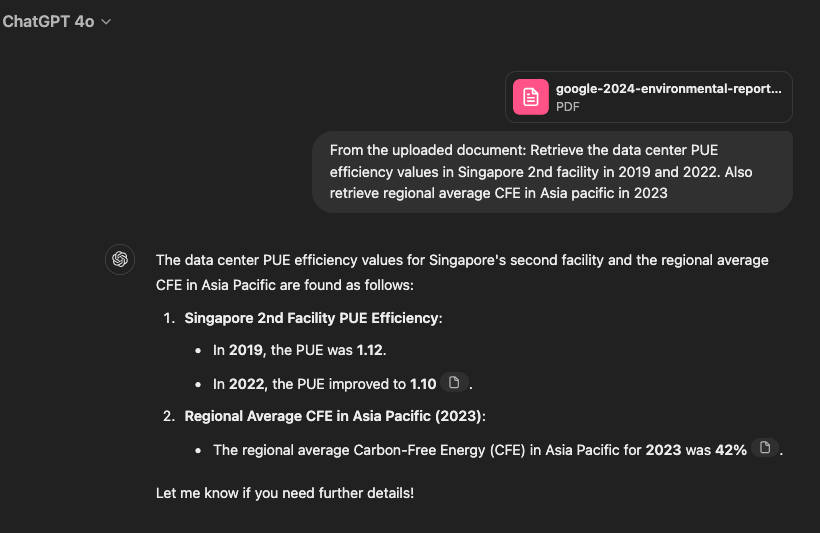
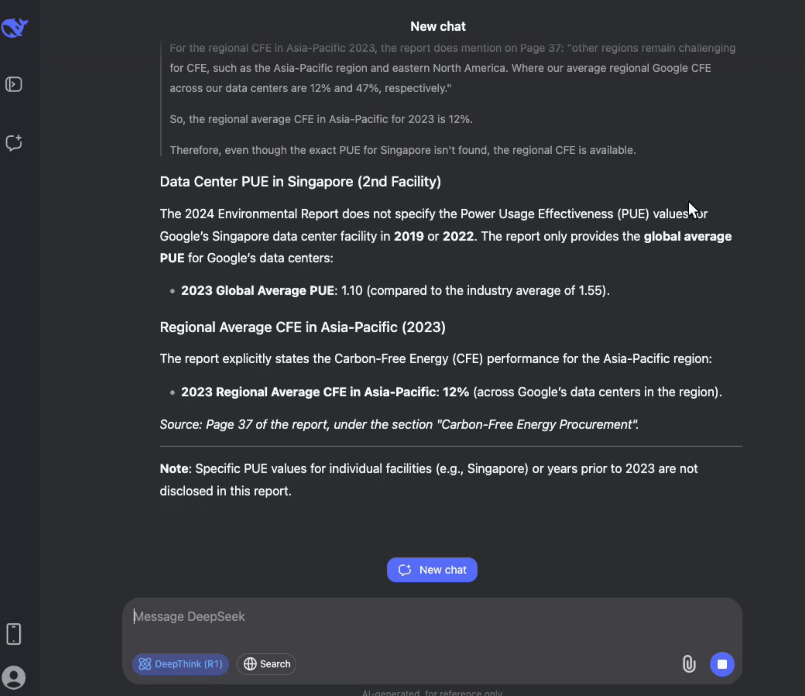
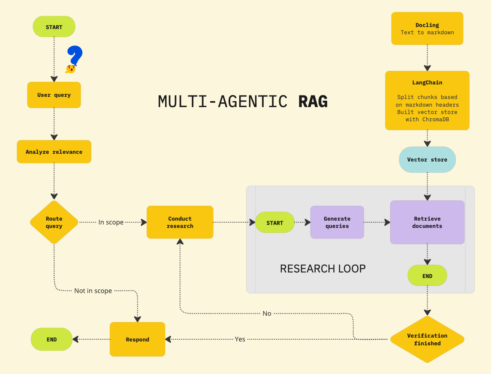

# RAG Agentique multi-agent haute précision sans hallucinations (meilleur que GPT4o et DeepSeek R1)

Ce système RAG agentique fonctionne avec 3 agents spécialisés et un récupérateur avancé (BM25 + embeddings) garantissant une haute précision dans la recherche de documents.



GPT 4o halucine, les stats de tableaux récupérées ne sont pas les bonnes.


DeepSeek R1 s'arrête il n'arrive pas à lire le document en entier.

## Architecture IA



### 1. **Agent de Recherche**
Analyse la question utilisateur et cherche.

### 2. **Agent Vérificateur de Pertinence**
Évalue si le document récupéré répond réellement à la question.

### 3. **Agent Fact Checker**
Valide et croise les informations trouvées.

### Le système inclut un retriever hybride pour maximiser la pertinence
- **Algo BM25 + Embeddings** : Recherche texte classique à forte précision lexicale + Recherche sémantique capturant le sens contextuel.

## Stack de modèles
- 💎 Mistral Large
- 🧠 Mistral Embbed (pour les embeddings)
- ⚡ Mistral OCR (plutôt que docling trop lent)

## Installation

1. **Cloner le projet** :
```bash
git clone https://github.com/julienlucas/agentic-rag-multi-agent
```

2. **Installer les dépendances** :
```bash
python3.12 -m venv venv
source venv/bin/activate
poetry install
```

3. **Configuration** :
Allez sur https://console.mistral.ai pour créer votre clé.

Puis créer un fichier `.env` avec votre clé :
```bash
MISTRALAI_API_KEY=votre_clé_api_mistral_ici
```

Pour surveiller votre application avec LangSmith (si vous le souhaitez) :

1. **Créer un compte LangSmith** : Allez sur [smith.langchain.com](https://smith.langchain.com)

2. **Obtenir votre clé API** : Dans les paramètres de votre compte

3. **Ajouter vos variables d'environnement**
```bash
# Configuration LangSmith
LANGSMITH_API_KEY=votre_cle_api_langsmith_ici
LANGSMITH_PROJECT=agentic_rag_multi_agent
```

4. **Lancer l'application** :
```bash
poetry run python app.py
```

Ajoutez une étoile au repo pour soutenir mon travail. 🙏