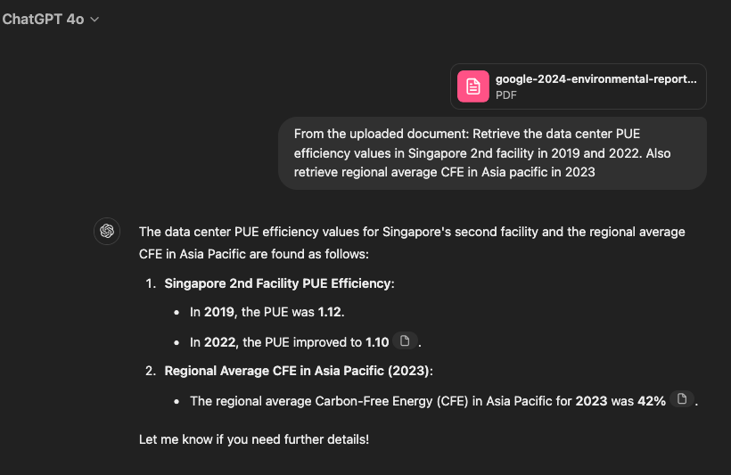
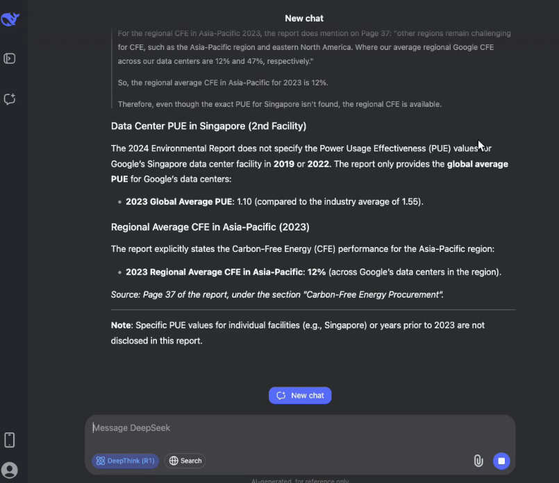

# RAG Agentique multi-agent haute précision sans hallucinations (meilleur que GPT4o et DeepSeek R1)

Ce système RAG agentique fonctionne avec 3 agents spécialisés et un récupérateur avancé (BM25 + embeddings) garantissant une haute précision dans la recherche de documents.



GPT 4o halucine, les stats de tableaux récupérées ne sont pas les bonnes.


DeepSeek R1 s'arrête il n'arrive pas à lire le document en entier.

## Architecture IA


### 1. **Agent de Recherche**
Analyse la question utilisateur et cherche.

### 2. **Agent Vérificateur de Pertinence**
Évalue si le document récupéré répond réellement à la question.

### 3. **Agent Fact Checker**
Valide et croise les informations trouvées.

### Le système inclut un retriever hybride pour maximiser la pertinence
- **Algo BM25 + Embeddings** : Recherche texte classique à forte précision lexicale + Recherche sémantique capturant le sens contextuel.

## Stack de modèles
- 💎 Mistral Large
- 🧠 Mistral Embbed (pour les embeddings)
- ⚡ Mistral OCR (plutôt que docling trop lent)

## Installation

1. **Cloner le projet** :
```bash
git clone https://github.com/julienlucas/agentic-rag-multi-agent
```

2. **Installer les dépendances** :
```bash
python3.12 -m venv venv
source venv/bin/activate
poetry install
```

3. **Configuration** :
Allez sur https://console.mistral.ai pour créer votre clé.

Puis créer un fichier `.env` avec votre clé :
```bash
MISTRALAI_API_KEY=votre_clé_api_mistral_ici
```

Pour surveiller votre application avec LangSmith (si vous le souhaitez) :

1. **Créer un compte LangSmith** : Allez sur [smith.langchain.com](https://smith.langchain.com)

2. **Obtenir votre clé API** : Dans les paramètres de votre compte

3. **Ajouter vos variables d'environnement**
```bash
# Configuration LangSmith
LANGSMITH_API_KEY=votre_cle_api_langsmith_ici
LANGSMITH_PROJECT=agentic_rag_multi_agent
```

4. **Lancer l'application** :
```bash
poetry run python app.py
```

## Évaluation (pertinence + avant/après)

**Lancer l'évaluation** :
```bash
uv run python evaluation/run_eval.py \
  --dataset evaluation/dataset.jsonl \
  --mode both \
  --out-dir evaluation/outputs
```
Les résultats sont dans `evaluation/outputs/` (`eval_summary.json` et `eval_results.json`).

Métriques suivies :
- Retrieval : `recall@k`, `mrr@k`, `ndcg@k`
- Réponse : `mean_f1`, `context_hit_rate`
- Vérification : `supported_rate`, `relevant_rate`

Fichiers générés :
- `eval_summary.json`
- `eval_results.json`
- `eval_regressions.json`
- `eval_errors.json`

## RAG‑Evals (Ragas)

```bash
uv run python evaluation/run_ragas.py \
  --dataset evaluation/dataset.jsonl \
  --mode agentic \
  --out-dir evaluation/ragas_outputs
```
Résultats : `ragas_summary.json`, `ragas_results.json`.

## CI (GitHub Actions)

Workflow : `.github/workflows/eval.yml`

Secrets requis :
- `MISTRALAI_API_KEY`
- `LANGSMITH_API_KEY` (optionnel)

## Déploiement

Le projet est configuré pour déployer le frontend sur Vercel et le backend sur Railway.

### Déploiement du Backend sur Railway

1. **Créer un projet sur Railway** : https://railway.app
2. **Connecter votre repository GitHub**
3. **Configurer les variables d'environnement** :
   - `MISTRALAI_API_KEY` : Votre clé API Mistral
   - `LANGSMITH_API_KEY` : (optionnel) Votre clé API LangSmith
   - `CORS_ALLOWED_ORIGIN` : L'URL de votre frontend Vercel (ex: `https://your-app.vercel.app`)
4. **Railway détectera automatiquement** le `Dockerfile` et `railway.toml`
5. **Notez l'URL de votre backend** Railway (ex: `https://your-app.railway.app`)

### Déploiement du Frontend sur Vercel

1. **Créer un projet sur Vercel** : https://vercel.com
2. **Connecter votre repository GitHub**
3. **Configurer les variables d'environnement** :
   - `VITE_API_URL` : L'URL de votre backend Railway (ex: `https://your-app.railway.app`)
4. **Vercel détectera automatiquement** le `vercel.json` et déploiera le frontend
5. **Mettre à jour CORS_ALLOWED_ORIGIN** sur Railway avec l'URL Vercel

### Structure de déploiement

- **Frontend (Vercel)** : Le répertoire `frontend/` est déployé sur Vercel
- **Backend (Railway)** : Le répertoire `backend/` est déployé sur Railway via Docker
- Les fichiers `.vercelignore` et `vercel.json` garantissent que seul le frontend est déployé sur Vercel

Ajoutez une étoile au repo pour soutenir mon travail. 🙏