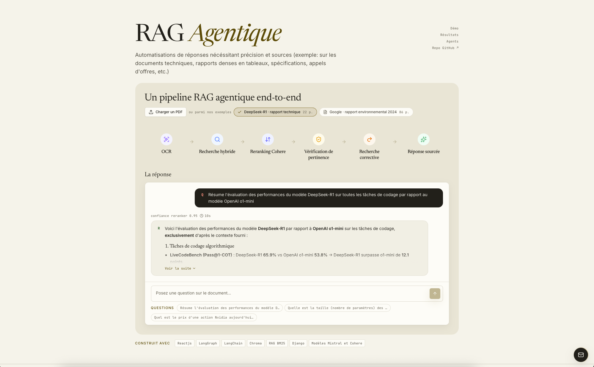
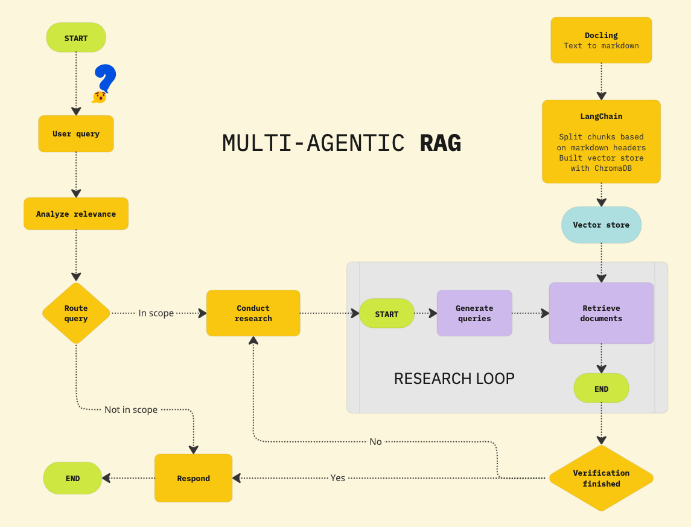

# RAG Agentique multi-agent, évalué sur FinanceBench

Ce système RAG combine un récupérateur hybride (BM25 + embeddings + reranking Cohere), un routage
par document et des agents spécialisés, sur des rapports SEC de 150 à 260 pages. Il est **mesuré**
sur [FinanceBench](https://github.com/patronus-ai/financebench), le benchmark utilisé par Mistral
pour évaluer Agentic Search : 71-81 % de réponses correctes selon le run, contre ~19 % pour le
RAG naïf du papier. Tous les chiffres cités ici sont reproductibles à partir des sorties versionnées
dans `evaluation/financebench/outputs/` — [résultats et limites](#évaluation-financebench-documents-financiers-difficiles).

## Architecture IA à la base avant améliorations



### 1. **Agent Vérificateur de Pertinence**
Évalue si les passages récupérés répondent réellement à la question (CAN_ANSWER / PARTIAL / NO_MATCH).

### 2. **Agent de Recherche Corrective**
Si le vérificateur classe les passages `PARTIAL` ou `NO_MATCH`, il réécrit la question dans le vocabulaire du document (ex. « legal battles » → *litigation*), relance la recherche, et **ajoute** jusqu'à 5 passages — reclassés par Cohere contre la question d'origine — après les 10 initiaux, sans jamais les remplacer.

> Trois règles, chacune tirée d'un run FinanceBench où son absence coûtait des réponses : les requêtes réécrites sont en langage naturel (le modèle produisait du booléen `"x" AND "y"`, inutilisable) ; les passages ajoutés sont reclassés contre la question d'origine, pas contre la réécriture ; les 10 passages initiaux sont intouchables. Résultat : la preuve atteint le modèle sur 17 questions sur 21 au lieu de 14.

### 3. **Agent de Recherche**
Génère la réponse finale, contrainte aux seuls passages récupérés — refuse explicitement quand l'information n'y est pas.

### Le système inclut un retriever hybride pour maximiser la pertinence
- **Algo BM25 + Embeddings** : Recherche texte classique à forte précision lexicale + Recherche sémantique capturant le sens contextuel.
- **Routage par document** : avant de chercher, le système cible le(s) document(s) que la question désigne (nom d'entreprise ou de fichier) — indispensable quand plusieurs documents longs sont indexés ensemble.
- **Reranking Cohere + parent-child + multi-query** : petits chunks pour matcher, gros chunks pour répondre.

## Stack de modèles
- ⚡ Mistral OCR (plutôt que docling trop lent)
- 🧠 Mistral Embed (embeddings)
- 🧠 Cohere Rerank v4 Pro multi-langue
- 💎 Mistral Large (génération) + Mistral Small (sous-agents : pertinence, routage, réécriture)

## Installation

1. **Cloner le projet** :
```bash
git clone https://github.com/julienlucas/agentic-rag-multi-agent
```

2. **Installer les dépendances** :
```bash
uv sync
```

3. **Configuration** :
Allez sur https://console.mistral.ai pour créer votre clé.

Puis créer un fichier `.env` avec vos clés ([console.mistral.ai](https://console.mistral.ai) et [dashboard.cohere.com](https://dashboard.cohere.com)) :
```bash
MISTRALAI_API_KEY=votre_clé_api_mistral_ici
COHERE_API_KEY=votre_clé_api_cohere_ici
LANGSMITH_API_KEY=
```

Pour surveiller votre application avec LangSmith (si vous le souhaitez) :

1. **Créer un compte LangSmith** : Allez sur [smith.langchain.com](https://smith.langchain.com)

2. **Obtenir votre clé API** : Dans les paramètres de votre compte

3. **Ajouter vos variables d'environnement**
```bash
# Configuration LangSmith
LANGSMITH_API_KEY=votre_cle_api_langsmith_ici
LANGSMITH_PROJECT=agentic_rag_multi_agent
```

4. **Lancer l'application** :
```bash
uv run python manage.py runserver
```

## Évaluation sur le jeu interne (généralisation + non-régression)

40 questions en **français** sur 2 documents non financiers (rapport technique DeepSeek, rapport
environnemental Google 2024), réparties en factuelles / numériques / synthèse / multi-passages /
hors-contexte.

> **Ce jeu ne produit pas un chiffre publiable** : sa vérité terrain est rédigée à la main, on ne
> se fait pas noter sur un examen qu'on a écrit soi-même. C'est FinanceBench (annotation experte
> externe, plus bas) qui porte le score. Celui-ci sert à deux choses que FinanceBench ne couvre
> pas : vérifier que le pipeline tient **hors du domaine financier**, et le mesurer **en
> français** — la langue d'usage réelle.

**Lancer l'évaluation** (~11 min) :
```bash
uv run python evaluation/run_eval.py --mode both --out-dir evaluation/outputs
```

Options utiles : `--workers 1` en cas de rate limits, `--judge detailed` pour l'ancien juge à
3 axes (correctness / faithfulness / completeness, 3 appels LLM par question au lieu d'un),
`--max-items N` / `--no-judge` pour un essai rapide.

> Un run partiel refuse d'écrire dans `evaluation/outputs/` : il remplacerait les chiffres
> publiés ci-dessous par un échantillon. Pour un essai :
> `uv run python evaluation/run_eval.py --max-items 3 --no-judge --out-dir /tmp/eval-essai`

**Résultats** — run du 2 septembre 2026, 40 questions, même juge et même protocole que
FinanceBench pour que les deux jeux soient lisibles côte à côte :

| | Correctes | Hallucinations | Refus |
|---|---|---|---|
| Avec les agents | 90,0 % (36/40) | 1/40 | 3/40 |
| Sans les agents | 87,5 % (35/40) | 2/40 | 3/40 |

Retrieval : `recall@10` 74,5 %, `mrr@10` 90,8 %, `context_hit_rate` 92,5 %.

Ce corpus est nettement plus facile que FinanceBench (2 documents d'une trentaine de pages contre
3 filings de 150 à 260), d'où l'écart de score — c'est attendu, et c'est pourquoi ce jeu ne sert
pas de vitrine. Deux choses qu'il montre et que FinanceBench ne montre pas :

- **Les 3 refus sont légitimes**, dont les 2 questions hors-contexte que le jeu contient exprès
  (« le prix d'un abonnement DeepSeek Pro » dans un rapport technique). Le système ne les invente
  pas : il classe `NO_MATCH`, déclenche la recherche corrective, ne trouve rien, et refuse.
- **La même régression que sur FinanceBench s'y reproduit** : l'unique réponse perdue par le mode
  agentic (`gg-6`) est classée `PARTIAL`. Deux corpus, deux langues, le même symptôme — le signal
  `PARTIAL` dégrade la génération. C'est le correctif prioritaire.

Les résultats sont dans `evaluation/outputs/` (`eval_summary.json` et `eval_results.json`).

Métriques suivies :
- Retrieval : `recall@k`, `mrr@k`, `ndcg@k`
- Réponse : `mean_f1`, `context_hit_rate`
- Juge : `accuracy`, `hallucination_rate`, `refusal_rate`, avec comptages bruts
  (`--judge detailed` donne à la place `mean_correctness` / `mean_faithfulness` / `mean_completeness`)
- Vérification : `relevant_rate` (issu du rapport du pipeline)

> `supported_rate` et le `hallucination_rate` hors juge LLM sont à `null` depuis le
> retrait du `VerificationAgent` (avril 2026) : le rapport de vérification est construit
> à partir des signaux du pipeline et ne contient plus la ligne « Supporté ». La seule
> mesure d'hallucination vivante est celle du juge LLM.

Fichiers générés :
- `eval_summary.json`
- `eval_results.json`
- `eval_regressions.json`
- `eval_errors.json`

## Évaluation FinanceBench (documents financiers difficiles)

Deuxième évaluation, sur [FinanceBench](https://github.com/patronus-ai/financebench) (Patronus AI) —
le benchmark utilisé par [Mistral pour évaluer Agentic Search](https://mistral.ai/news/agentic-search/) :
QA sur des filings SEC de 150 à 260 pages, denses en tableaux.

**Préparation (une seule fois, ~5-15 min)** — télécharge, OCRise et met en cache 3 10-K (AMD, American Express, Boeing) :
```bash
uv run python evaluation/financebench/prepare.py
```

**Lancer l'évaluation (5-10 min)** :
```bash
uv run python evaluation/financebench/run_financebench_eval.py --mode both
```

**Résultats** — run du 2 septembre 2026, versionné dans `evaluation/financebench/outputs/`.
21 questions, 3 filings, index combiné, juge LLM au protocole du benchmark, comptages bruts :

| | Correctes | Hallucinations | Refus |
|---|---|---|---|
| Ce système, **avec** les agents | **85,7 % (18/21)** | 14,3 % (3/21) | 0 |
| Ce système, **sans** les agents (même retrieval, une seule génération) | 71,4 % (15/21) | 28,6 % (6/21) | 0 |
| RAG naïf — papier FinanceBench (GPT-4-Turbo 2023, benchmark complet) | ~19 % | 81 % de réponses fausses ou refusées | |
| Mistral Agentic Search — repère externe (Medium 3.5, 150 questions) | 86 % | | |
| Outils RAG juridiques commerciaux (étude Stanford) | 42-65 % | 17-33 % | |

Les trois dernières lignes portent sur des échantillons différents du nôtre : ce sont des repères
d'ordre de grandeur, pas un match à armes égales.

### Ce que ce run dit, et ce qu'il ne dit pas

- **Le chiffre solide, c'est la preuve transmise au modèle : 17 questions sur 21, contre 14 sans
  les agents.** Il ne dépend pas des humeurs du LLM — c'est du retrieval — et il est stable sur
  les trois derniers runs. La recherche corrective se déclenche sur 9 questions (`corrective_rate`
  42,9 %) et ramène de la preuve sur 3 d'entre elles.
- **Le +3 en accuracy est à lire avec prudence.** Mistral Large n'est pas déterministe à
  température 0 : la baseline oscille entre 15 et 19 bonnes réponses d'un run à l'autre sur un
  contexte strictement identique. Ce qui tient d'un run à l'autre : depuis les trois correctifs
  de la recherche corrective, le mode agentic est au niveau ou au-dessus de la baseline à chaque
  run (18, 17, 17), alors qu'il était derrière avant (12, 15).
- **Le prix : la génération est deux fois plus lente** (10,3 s contre 5,4 s par question),
  le coût des réécritures et de la seconde recherche sur les questions `PARTIAL`.
- **Le facteur limitant reste le retrieval.** Quand la preuve atteint le modèle, il répond juste
  15 fois sur 17 ; quand elle ne l'atteint pas, 3 fois sur 4 seulement — et ce sont des questions
  à réponse négative. L'éval le mesure directement : `page_hit@k` / `page_recall@k`, exacts grâce
  aux pages annotées.

> Le `refusal_rate` des runs antérieurs au 2 septembre 2026 (~10 %) était un artefact : le juge
> classait `REFUSAL` toute réponse *contenant* une des phrases de refus du pipeline, y compris au
> milieu d'une réponse complète et correcte. Corrigé — le refus doit désormais constituer toute
> la réponse. Les 6 verdicts `REFUSAL` du run précédent portaient sur des réponses de 300 à
> 1 900 caractères ; après correction, le taux de refus est de 0 %.

Détail du protocole, options et notes d'implémentation : [`evaluation/financebench/README.md`](evaluation/financebench/README.md).

## Déploiement

Le projet est configuré pour déployer le frontend sur Vercel et le backend sur Railway.

### Déploiement du Backend sur Railway

1. **Créer un projet sur Railway** : https://railway.app
2. **Connecter votre repository GitHub**
3. **Configurer les variables d'environnement** :
   - `MISTRALAI_API_KEY` : Votre clé API Mistral
   - `LANGSMITH_API_KEY` : (optionnel) Votre clé API LangSmith
   - `CORS_ALLOWED_ORIGIN` : L'URL de votre frontend Vercel (ex: `https://your-app.vercel.app`)
4. **Railway détectera automatiquement** le `Dockerfile` et `railway.toml`
5. **Notez l'URL de votre backend** Railway (ex: `https://your-app.railway.app`)

### Déploiement du Frontend sur Vercel

1. **Créer un projet sur Vercel** : https://vercel.com
2. **Connecter votre repository GitHub**
3. **Configurer les variables d'environnement** :
   - `VITE_RAILWAY_API_URL` : L'URL de votre backend Railway (ex: `https://your-app.railway.app`)
4. **Vercel détectera automatiquement** le `vercel.json` et déploiera le frontend
5. **Mettre à jour CORS_ALLOWED_ORIGIN** sur Railway avec l'URL Vercel

### Structure de déploiement

- **Frontend (Vercel)** : Le répertoire `frontend/` est déployé sur Vercel
- **Backend (Railway)** : Le répertoire `backend/` est déployé sur Railway via Docker
- Les fichiers `.vercelignore` et `vercel.json` garantissent que seul le frontend est déployé sur Vercel

Ajoutez une étoile au repo pour soutenir mon travail. 🙏